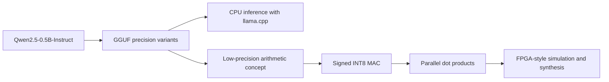

# Efficient LLM Inference and FPGA MAC Accelerator Study

Status: **Day 1 complete**. This is a six-day learning and engineering study, not a complete LLM accelerator.

## 1. Project motivation

Large language model inference repeatedly performs arithmetic on many weights. Reduced precision may lower storage and data movement costs. This project connects a small, reproducible quantization experiment to a simulated FPGA-style arithmetic design.

## 2. Research question

For the same Qwen2.5-0.5B-Instruct model on one CPU system, how do FP16, Q8_0, and Q4_K_M compare in file size, memory, speed, latency, and responses to a small common prompt set? How does signed INT8 multiply-accumulate arithmetic illustrate one building block of quantized neural-network computation?

## 3. System overview

The CPU benchmark and HDL study are separate experiments connected by the arithmetic used in neural-network layers. The HDL design will **not** execute Qwen or directly implement Q4_K_M.

## 4. LLM benchmark methodology

Day 2 will use the same prompt set, model family, backend, CPU-only configuration, thread count, context length, and generation settings for all three variants. Raw responses and structured measurements will be retained. Objective questions will have simple checkable answers; other responses will be kept for manual review. This will be an **exploratory quality and efficiency comparison**, not a rigorous model-intelligence evaluation. See [llm/README.md](llm/README.md) and [benchmarks/README.md](benchmarks/README.md).

## 5. Quantization explanation

Quantization represents values using fewer bits, usually with a mapping between stored integers and approximate real values. FP16 uses a 16-bit floating-point format; Q8_0 and Q4_K_M are GGUF weight-quantization formats. Their labels do not mean every byte in the file is exactly 8 or 4 bits per parameter. See [docs/quantization.md](docs/quantization.md).

## 6. FPGA arithmetic experiment

Days 4 and 5 will implement and self-check a signed INT8 MAC and four-lane dot product in SystemVerilog. Simulation will establish functional behavior. Synthesis, if available, will report generic logic statistics, not physical DE0-Nano utilization or measured clock speed. No FPGA board is available. See [fpga/README.md](fpga/README.md).

## 7. Relationship between quantization and hardware acceleration

Many neural-network layers compute sums of products, `y = Σ(wᵢ × xᵢ)`. A MAC adds one product to an accumulator; a dot product sums several products. Lower precision can reduce model storage and memory bandwidth, and can permit smaller arithmetic units and more parallel operations. Actual energy, speed, and area depend on the implementation and must be measured or synthesized. Q4_K_M uses blockwise quantization and is **not** mapped directly to this simple INT8 datapath. The HDL is a conceptual learning bridge, not Qwen inference hardware.

## 8. Experimental setup

Day 1 local environment (2026-09-23): Windows x64 (build 26200), Intel Core i7-8650U, 8 logical processors, 15.92 GiB physical RAM, Python 3.14.7, Git 2.55.0.windows.5. `winget` is unavailable here, so the baseline uses the official `llama.cpp` Windows x64 CPU release **b10938** (commit `f1e44dcc1`). Model files come from the [official Qwen GGUF repository](https://huggingface.co/Qwen/Qwen2.5-0.5B-Instruct-GGUF/tree/main). Exact baseline command and verification are in [llm/README.md](llm/README.md).

## 9. Results

No three-format benchmark results yet. Day 1's Q4_K_M functional check returned `Paris` to a one-word capital question. An earlier arithmetic prompt returned an incorrect answer; both raw outputs are retained under `results/raw/`. These are smoke tests, not comparative accuracy or speed measurements. Measured CPU findings will appear under `results/`; simulated HDL findings will be recorded separately.

## 10. Limitations

One machine, a small prompt set, and a small 0.5B-parameter model limit generalization. CPU timings can vary with system load and caching. Functional simulation does not establish FPGA timing, energy use, or physical resource use. No physical FPGA result will be claimed.

## 11. Future work

Complete the benchmark on Days 2–3, the HDL simulation on Days 4–5, and integration and interview notes on Day 6. See [PROGRESS.md](PROGRESS.md).

## Reproducing the Day 1 baseline on Windows

From PowerShell in the repository root, follow [llm/README.md](llm/README.md). The downloaded release and GGUF belong in `.local/`, which Git ignores. No CUDA setup is needed.

## Sources and licenses

- [Qwen2.5-0.5B-Instruct-GGUF model repository](https://huggingface.co/Qwen/Qwen2.5-0.5B-Instruct-GGUF) (model license: Apache-2.0)
- [llama.cpp installation guide](https://github.com/ggml-org/llama.cpp/blob/master/docs/install.md) and [release b10938](https://github.com/ggml-org/llama.cpp/releases/tag/b10938)
- This repository's original code and documentation: MIT license (see `LICENSE`). Model and backend licenses remain their own.
