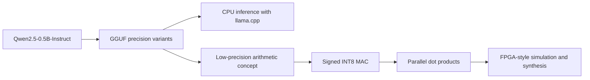

# Efficient LLM Inference and FPGA MAC Accelerator Study

Status: **Benchmark and comparative analysis complete; MAC RTL and testbench written, simulation pending**. The shared prompt set and three model variants have completed one audited 60-run CPU benchmark pass. This is an incremental learning and engineering study, not a complete LLM accelerator.

## 1. Project motivation

Large language model inference repeatedly performs arithmetic on many weights. Reduced precision may lower storage and data movement costs. This project connects a small, reproducible quantization experiment to a simulated FPGA-style arithmetic design.

## 2. Research question

For the same Qwen2.5-0.5B-Instruct model on one CPU system, how do FP16, Q8_0, and Q4_K_M compare in file size, memory, speed, latency, and responses to a small common prompt set? How does signed INT8 multiply-accumulate arithmetic illustrate one building block of quantized neural-network computation?

## 3. System overview

The CPU benchmark and HDL study are separate experiments connected by the arithmetic used in neural-network layers. The HDL design will **not** execute Qwen or directly implement Q4_K_M.

## 4. LLM benchmark methodology

The benchmark used the same prompt set, model family, backend, CPU-only configuration, thread count, context length, and generation settings for all three variants. Raw responses and structured measurements were retained. Objective questions have simple checkable answers; summaries are kept for manual review. This is an **exploratory quality and efficiency comparison**, not a rigorous model-intelligence evaluation. See [llm/README.md](llm/README.md) and [benchmarks/README.md](benchmarks/README.md).

## 5. Quantization explanation

Quantization represents values using fewer bits, usually with a mapping between stored integers and approximate real values. FP16 uses a 16-bit floating-point format; Q8_0 and Q4_K_M are GGUF weight-quantization formats. Their labels do not mean every byte in the file is exactly 8 or 4 bits per parameter. See [docs/quantization.md](docs/quantization.md).

## 6. FPGA arithmetic experiment

The hardware study has a signed INT8 MAC and self-checking SystemVerilog testbench. Windows Device Guard currently prevents the installed simulator from running, so functional verification remains pending. A four-lane dot product is planned next. Simulation can establish functional behavior once run; synthesis, if available, will report generic logic statistics, not physical DE0-Nano utilization or measured clock speed. No FPGA board is available. See [fpga/README.md](fpga/README.md).

## 7. Relationship between quantization and hardware acceleration

Many neural-network layers compute sums of products, `y = Σ(wᵢ × xᵢ)`. A MAC adds one product to an accumulator; a dot product sums several products. Lower precision can reduce model storage and memory bandwidth, and can permit smaller arithmetic units and more parallel operations. Actual energy, speed, and area depend on the implementation and must be measured or synthesized. Q4_K_M uses blockwise quantization and is **not** mapped directly to this simple INT8 datapath. The HDL is a conceptual learning bridge, not Qwen inference hardware.

## 8. Experimental setup

Test environment (recorded 2026-09-23): Windows x64 (build 26200), Intel Core i7-8650U, 8 logical processors, 15.92 GiB physical RAM, Python 3.14.7, Git 2.55.0.windows.5. `winget` is unavailable here, so the baseline uses the official `llama.cpp` Windows x64 CPU release **b10938** (commit `f1e44dcc1`). Model files come from the [official Qwen GGUF repository](https://huggingface.co/Qwen/Qwen2.5-0.5B-Instruct-GGUF/tree/main). Exact baseline command and verification are in [llm/README.md](llm/README.md).

## 9. Results

The benchmark dataset contains 60 CPU runs: 20 common prompts for each of FP16, Q8_0, and Q4_K_M. [The audit](llm/audit_results.py) found 60/60 records consistent with their raw transcripts and fixed settings. Strict exact checks passed for FP16 9/17, Q8_0 8/17, and Q4_K_M 10/17; three summaries per variant await manual review. [The analysis script](analysis/analyze_results.py) generates [processed tables](results/processed/benchmark_summary.csv) and a [comparison figure](analysis/plots/benchmark_tradeoffs.png) from those records. These are exploratory observations, not a stable performance or broad model-quality ranking. Setup smoke tests remain separate from this batch.

## 10. Limitations

One machine, one timing pass per prompt/model pair, a small prompt set, and a small 0.5B-parameter model limit generalization. Strict exact checks include formatting requirements, and CPU timings can vary with system load and caching. Whole-process duration includes model loading; separate loading time, peak process RAM, time to first token, and model-only inference latency were not measured reliably. The MAC has not yet passed an HDL simulation on this machine because Device Guard blocks the installed Icarus executable. Future functional simulation will not establish FPGA timing, energy use, or physical resource use. No physical FPGA result is claimed.

## 11. Future work

Run the MAC testbench with an approved simulator, then implement the parallel dot product, integration, and interview notes. Additional numbered timing trials can be run if a stronger speed estimate is needed. See [PROGRESS.md](PROGRESS.md).

## Reproducing the baseline on Windows

From PowerShell in the repository root, follow [llm/README.md](llm/README.md). The downloaded release and GGUF belong in `.local/`, which Git ignores. No CUDA setup is needed.

For an interview-ready explanation and CMD/Git Bash commands, follow the [setup walkthrough](docs/setup_walkthrough.md).

## Sources and licenses

- [Qwen2.5-0.5B-Instruct-GGUF model repository](https://huggingface.co/Qwen/Qwen2.5-0.5B-Instruct-GGUF) (model license: Apache-2.0)
- [llama.cpp installation guide](https://github.com/ggml-org/llama.cpp/blob/master/docs/install.md) and [release b10938](https://github.com/ggml-org/llama.cpp/releases/tag/b10938)
- This repository's original code and documentation: MIT license (see `LICENSE`). Model and backend licenses remain their own.
